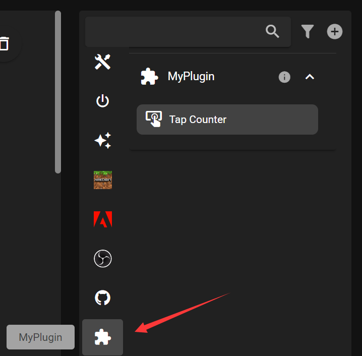

# Getting Started

Follow this document to create and run a FlexDesigner plugin.

## Plugin Architecture

FlexDesigner plugins consist of two parts: a frontend and a backend.

#### Frontend

Frontend is built with [vue3](https://vuejs.org/) and [Vuetify3](https://vuetifyjs.com/en/) and runs in a Chromium environment. Communicate with FlexDesigner via window object.

#### Backend

Backend is written in JavaScript and runs in Node.js. Communicate with FlexDesigner via WebSocket.

## Prerequisites

To develop a FlexDesigner plugin, you need:

- Node.js 18 or above
- FlexDesigner v1.0.0 or above
- A Flexbar
- A code editor (we recommend VS Code)

> We recommend using nvm to install and manage your Node.js environment.
> [nvm for MacOS](https://github.com/nvm-sh/nvm?tab=readme-ov-file#installing-and-updating)
> [nvm for Windows](https://github.com/coreybutler/nvm-windows/releases)

## Obtaining the SDK

Use Flex CLI to install and configure the SDK.

### Install FlexCLI

Run:

`npm install -g @eniac/flexcli`

This installs FlexCLI in your development environment. After installation, run `flexcli` in your terminal to ensure it’s correctly installed.

### Create Your First Plugin

Run:

`flexcli plugin create`

Then follow the prompts to provide the required parameters.

> Note: If you plan to share your plugin on our online platform, make sure to provide the correct repository link where your plugin is hosted. FlexDesigner will fetch and update your plugin from that link.

After a successful creation, your workspace will look like this:

```
│  .gitignore
│  package.json
│  rollup.config.mjs
│  
├─com.eniac.example.plugin
│  │  config.json
│  │  manifest.json
│  │  
│  ├─backend
│  ├─logs
│  ├─resources
│  └─ui
└─src
    plugin.js
```

#### com.`<author>`.`<name>`.plugin

This folder is your plugin directory. If you host your plugin on GitHub, it must be located at the root level; otherwise, FlexDesigner cannot recognize it.

- **config.json**: Stores data that needs to persist, such as user account details and plugin configurations
- **manifest.json**: Describes your plugin’s information
- **backend**: Contains compiled backend scripts
- **logs**: Default location for log files
- **resources**: Default location for resources like images
- **ui**: Holds the plugin’s frontend files

#### src

This directory contains your backend code, which runs as a child process in Node.js and communicates with FlexDesigner through WebSocket.

## First Run

Make sure FlexDesigner is running, then execute:

```
npm run build
npm run dev
```

This automatically compiles, bundles, and installs your plugin. You should then see your plugin in FlexDesigner’s Key Library:



Any changes you make in the plugin will automatically sync with FlexDesigner.

Congratulations! You’ve successfully created and run your first plugin.

For further development, you can refer to the sample plugins:

- [Example](https://github.com/ENIAC-Tech/Plugin-Example) – Shows all supported features and APIs
- [ScreenMirror](https://github.com/ENIAC-Tech/Plugin-ScreenMirror) – Mirrors a specific area of your screen to the Flexbar
