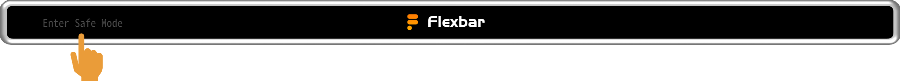
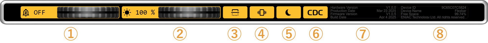

# Flexbar Connection Troubleshooting

If FlexDesigner fails to recognize your Flexbar, follow these steps to identify and resolve the issue.

## Verify Computer Recognition

Flexbar doesn't require additional USB drivers and should be automatically recognized when connected. Verify this through:

### Method 1: Test Flexbar Functions

1. **Access the Home Screen**:
   Press the "🏠" icon on the far left of Flexbar
   
2. **Test Device Functions**:
   Rotate the volume wheel or press media control buttons and observe your computer's response
   

If your computer's volume changes or media controls respond, your system has successfully recognized the Flexbar.

### Method 2: Check System Device Manager

#### Windows

1. Open Device Manager
2. Connect and disconnect Flexbar while watching the device list
3. If a device appears or disappears, your system recognizes the Flexbar

#### macOS

1. Click the Apple menu in the top left → Select "About This Mac"
2. Click "System Report" to enter System Information
3. Select "USB" in the Hardware section
4. Look for Flexbar in the USB device list

### Computer Not Recognizing Flexbar?

Try these solutions:

- Change USB ports (preferably using built-in computer ports)
- Avoid connecting through USB hubs or docking stations
- Try using a USB-A to USB-C cable

## Flexbar Recognized by Computer but Not Connecting to FlexDesigner

### Solution 1: Restart Devices

Restarting your computer and FlexDesigner is the simplest and most effective way to resolve most connection issues.

### Solution 2: Reinstall FlexDesigner

Download and reinstall the latest software from the [official website](https://eniacelec.com/pages/software).

### Solution 3: Switch USB Protocol

In rare cases, your system may have trouble communicating with Flexbar using a specific protocol. Flexbar supports both HID and CDC USB protocols. To switch between them:

1. **Enter Safe Mode**:
   During startup, click the "Enter SafeMode" button on the left side of the LOGO screen
   
2. **Access Settings**:
   Click the gear icon on the far right of Flexbar
   
3. **Switch USB Mode**:
   Press button 6 to toggle between CDC and HID modes
   
4. **Reconnect Flexbar**

## Still Having Issues?

If the above methods don't resolve your problem, please email contact@eniacelec.com. Our technical support team will contact you promptly to help solve the issue.
