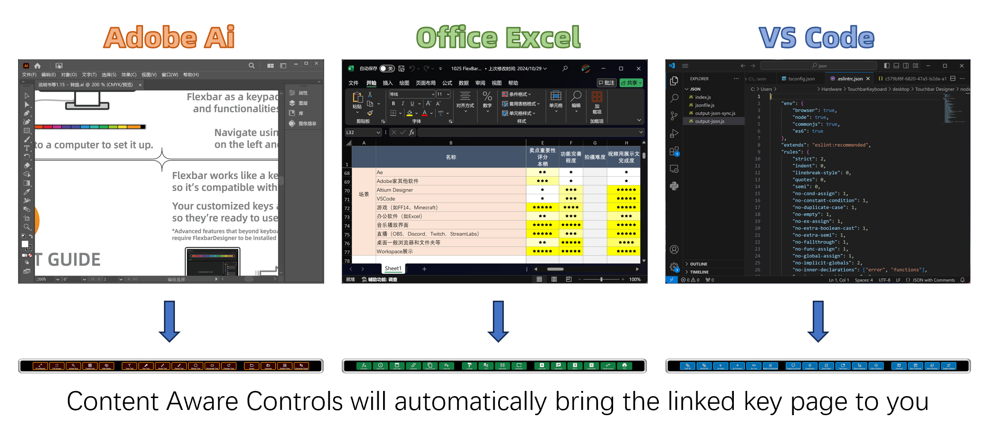
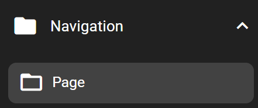
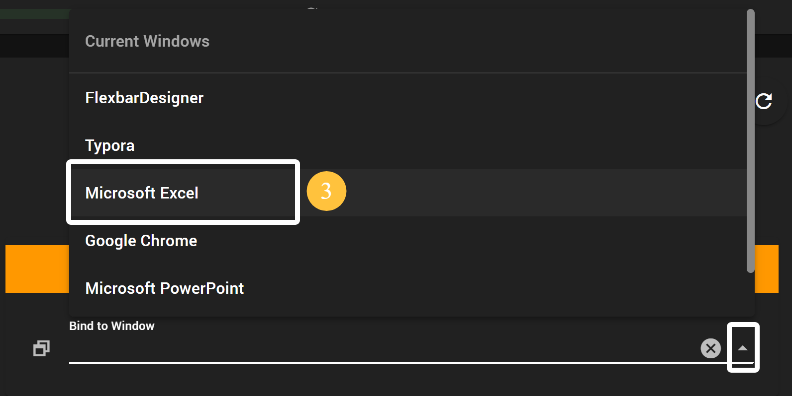

## "Content Aware Controls" Setup and Usage

### What is "Content Aware Controls"?

To make Flexbar more convenient to use, our "Content Aware Controls" feature automatically brings up the most frequently used shortcut interface on the screen while you open specific applications. Simply follow this tutorial to complete a few easy steps and achieve the following effect:

### How to Add

To make your Flexbar automatically display a specific page when using an application through "Content Aware Controls," you need to first create a page for display. You can find the "Page" key under the "Navigation" category in the Key Library on the right side. Drag it onto the virtual Flexbar to use it. For details, see the "How to Navigate on Flexbar" section.

You can add the shortcuts you frequently use with that application or import key packs from our presets or the "Market Place". For details, see the "How to Export and Import Pages" section.

> The linked Page can be placed anywhere in Flexbar's Pages directory; it does not affect the operation of "Content Aware Controls."
>
> Like all other keys, Pages can be renamed or have their appearance customized. You can rename the Page to match your application, but this does not affect the operation of "Content Aware Controls."
>
> More shortcut pre-sets will be uploaded to the Market Place for download soon. Please note that you will still need to **manually bind** these Pages to software windows, as the specific window and program names will vary on each computer.

### How to Set Up "Content Aware Controls"

① In Flexbar Designer, click on the Page you created for display (make sure to select the Page key itself in the parent folder, not inside the Page).

② You will see the Page's settings appear in the Configuration Panel below. Click the **FUNCTION** tab, and you will find the **Bind to Window** option.

③ Click the **Bind to Window** field. Flexbar Designer will acquire and list all currently open windows on your computer. Select the window you want to bind to this Page.

④ Don't forget to save and upload the configuration to your Flexbar for the settings to take effect.

### Result

When your computer opens or focuses (foreground use) on the previously bound window, Flexbar will automatically switch to the corresponding page you bind the window to. In this example, we bound the **Excel Page** to **Microsoft Excel**. When you use Microsoft Excel, Flexbar's "Content Aware Controls" feature will **automatically** **display** the Excel Page without requiring you to search through the many Pages on Flexbar.

> **Do not** bind multiple Pages to the same window.
>
> When clicking **Bind to Window**, only **currently open** windows will be displayed in the list. Make sure to open the application window you need to bind first when setting up. The binding relationship is based on the window.
>
> Applications can be bound to bring up Pages, but the Page key itself **does not** have the functionality to **launch applications**. If you need it that way, please use the **Open Application** key and place the aforementioned Pages elsewhere, binding them to the window as described above. This way, you can launch the application and open the corresponding Page with one click.
>
> *This feature requires Flexbar Designer to be running in the background to work.

### Sub-pages

When a parent page is bound to a specific application, all sub-pages will also be automatically bound to that application. When you enter a sub-page that is bound to an application, Flexbar will automatically remember the sub-page's position, and next time it will automatically jump back to the last sub-page you visited.
