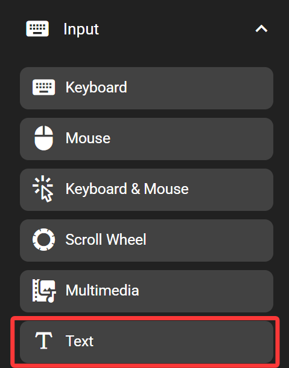

# Creating My First Profile

This guide will show you how to create a custom Flexbar profile to boost your productivity - using Microsoft Office Excel as an example.

## Creating an Excel Page

Find the Page key in the Navigation category of the Key Library and drag it onto your Flexbar.

For better visual appeal and usability, we recommend customizing this Page. For example, you can set the background color to dark green and use the Excel application icon.

In the Function tab, you can bind this page to Excel. This way, when you focus on an Excel window, Flexbar will automatically switch to your Excel page.

## Adding the Keys You Need

Now you can add the keys you need to your Excel page.

### Adding Shortcuts

When editing Excel data, you often need to change cell formats. For example, switching to number format requires pressing Ctrl+Shift+1, while switching to percentage format requires Ctrl+Shift+5.

You can find and add the Keyboard key from the Key Library.

For the number format shortcut, set the appearance to a number icon and configure the shortcut as Ctrl+Shift+1.

For the percentage format shortcut, set the appearance to a percentage icon and configure the shortcut as Ctrl+Shift+5.

We've successfully added two shortcuts to Flexbar. Operations that previously required pressing three keys can now be done with a single tap on Flexbar - what you see is what you get, and you don't need to memorize complex keyboard shortcuts.

### Adding Text Input

Excel requires memorizing many formulas. You can add a text input key to Flexbar to enter complex formulas for you. You can find this in the Input category.

For example, for the commonly used average formula, simply configure the key to input the formula when pressed.

Now you can enter this formula in Excel with just one tap on your Flexbar.

### Getting Pre-made Excel Keys

We provide pre-configured shortcut sets for many applications - including Excel. You can install our Excel key preset from FlexGate, which includes hundreds of Excel shortcuts and common formulas.

