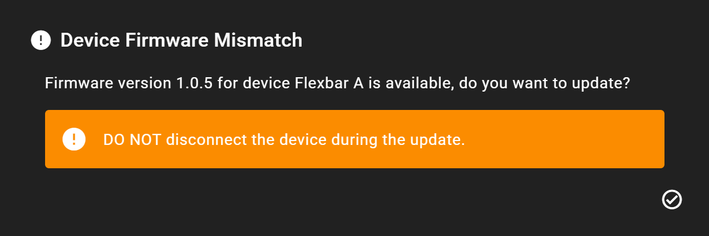
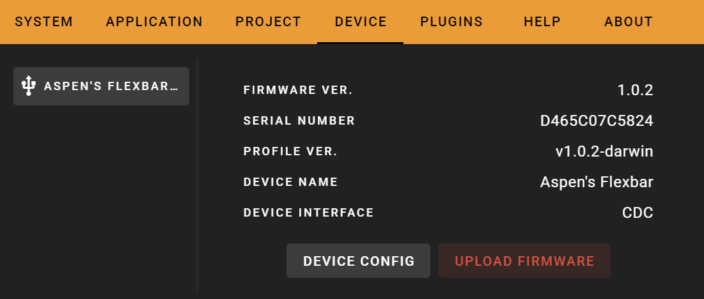
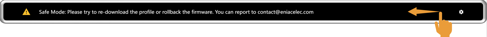
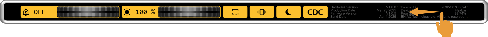
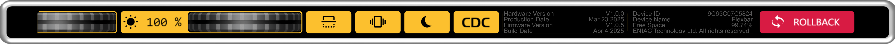

# Firmware

Firmware refers to the embedded software written into Flexbar's internal microcontroller, pre-installed at the factory. Updates to firmware are prompted via FlexDesigner when available. We recommend regularly updating to ensure access to the latest features and improved stability.

## Update your firmware

### Automatic Update

When a firmware update is available, FlexDesigner will display the following prompt. We recommend updating as soon as possible.

### Manual Update

**Under normal circumstances, you do not need to manually update your firmware. If a necessary firmware update is available, FlexDesigner will notify you.**

Go to `Setting -> Device`

Click `UPLOAD FIRMWARE`, then wait for the firmware upload to complete and the device to restart automatically.

**Note: Do not disconnect power during the update process**

### After update, device shows "Profile version does not match..."

It's normal for your device to display this screen after an update. The update requires you to re-upload your Profile to ensure the device is running the latest version. You simply need to upload your Profile again to resolve this.

## Unable to update your firmware

### If your Flexbar is running older firmware (<2.1.1), there is a very small chance that you may encounter an issue where Flexbar cannot update correctly. Don't worry—simply follow these steps to successfully update your Flexbar.

1. Follow the instructions in the `Update your firmware` section to update your Flexbar normally, but please monitor the update process (takes less than 1 minute).
2. After the update completes, Flexbar will automatically restart. During device startup, a LOGO screen will appear. On the far left of this screen, you will see `Enter Safe Mode`. Please click to enter Safe Mode before the LOGO disappears. This step is crucial. If you fail to enter Safe Mode in time, simply return to step 1, update the firmware again, and try once more.
3. Once in the device's Safe Mode interface, simply click Upload in the top-right corner of FlexDesigner to update your profile once.

## Rollback

If the updated firmware does not function properly, you can manually roll back to the previous version.

> You generally do not need to perform this operation

### Rollback in Safe Mode

1. Swipe left on the screen

2. Click `ROLLBACK` to revert to the previous firmware version

### Rollback from Settings Interface

1. Swipe left on the screen

2. Click `ROLLBACK` to revert to the previous firmware version

