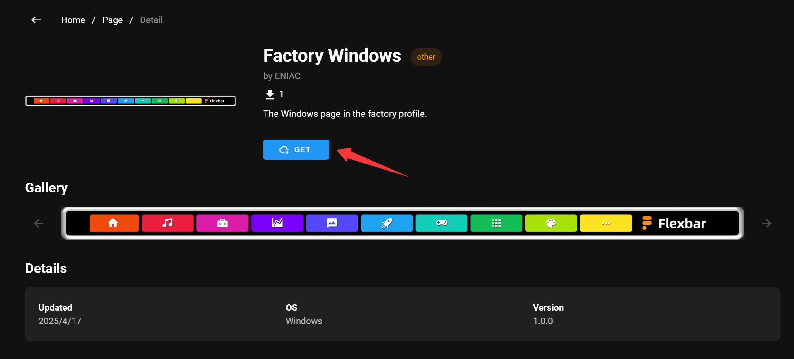

# FlexGate

FlexGate is an online sharing platform where you can easily find or share your own Profiles, Iconpacks, Pages, and Plugins.

## Installing from FlexGate

Installing a Profile, Iconpack, Page, or Plugin from FlexGate is very simple. Just make sure FlexDesigner is running, then click GET to automatically download and install.

## Uploading Profiles, Iconpacks, and Pages to FlexGate

Go to your personal profile page and click on the item you want to upload.

Before uploading, you need to fill in some information:

- Title: The name of your content - keep it concise and clearly describe its purpose
- Images: We recommend providing several screenshots to help users understand what your content does
- Category: Choose the most appropriate category for your content
- Operating System: Select which operating systems your content supports
- Version: Your own version number for the content (unrelated to FlexDesigner versions)
- Description: Detailed explanation of what your content does

## Uploading Plugins to FlexGate

Uploading a Plugin works slightly differently. We require Plugins to be hosted on GitHub. Simply enter your repository URL, and FlexGate will verify its validity.

> Make sure your repository was created with FlexCLI and has a valid plugin structure. Check out the [SDK documentation](sdk/index.html) to learn how to create custom plugins

Before uploading, you need to fill in some information:

- Images: We recommend providing several screenshots to help users understand what your plugin does
- Category: Choose the most appropriate category for your plugin

## FAQ
**Q: What is FlexGate?**

**A:** FlexGate is an online sharing platform where you can easily find or share your own Profiles, Iconpacks, Pages, and Plugins.

**Q: Can I publish paid content through FlexGate?**

**A:** The payment system is still under development. We plan to add this feature in a future update.

**Q: Content uploaded to FlexGate infringes on my rights.**

**A:** We take intellectual property rights seriously. Please email details of any infringing content to contact@eniacelec.com, and we will address your concerns promptly.

**Q: Where can I discuss and share with other creators?**

**A:** We recommend joining our [Discord community](https://discord.com/invite/7STSjmBpKT), where you'll find many like-minded creators.

**Q: How do I get customer support or submit suggestions?**

**A:** Please contact us at contact@eniacelec.com, or reach out directly to administrators in our Discord community. We'll respond as soon as possible.
